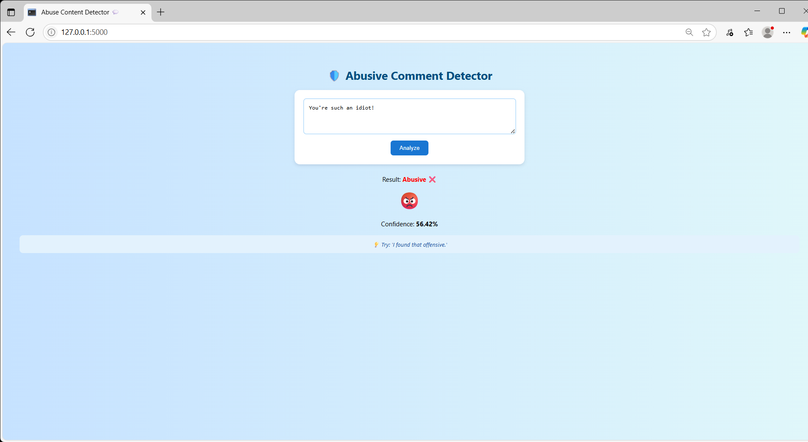
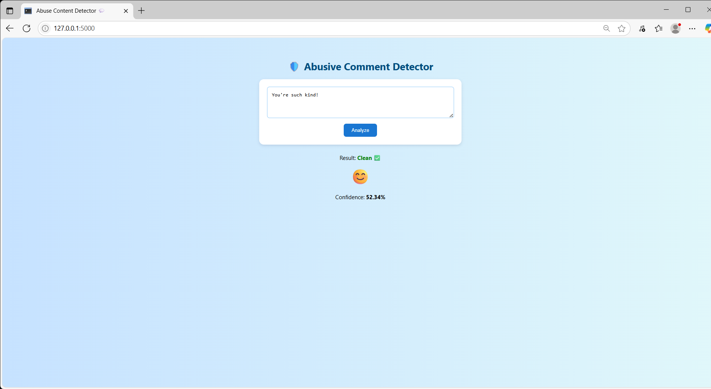

#  Abuse / Offensive Content Detector

This is a simple web application that detects abusive or offensive language in user comments. It uses a machine learning text classifier built with Flask.

---

##  About the Project

- Enter any comment in the web form.
- The app will predict if the comment is abusive or clean.
- Useful for moderating user-generated content.

---

## 🖥️ Screenshot

---

## 🛠️ Technologies Used

- Python
- Flask
- Scikit-learn (Machine Learning)
- HTML, Css

---

## ✨ Developed By

Gayatri Bhamre
